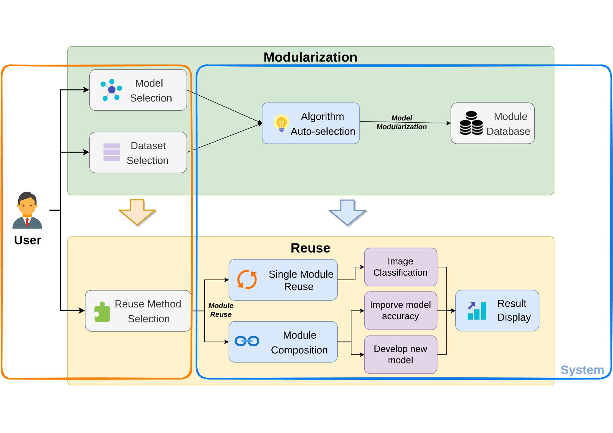
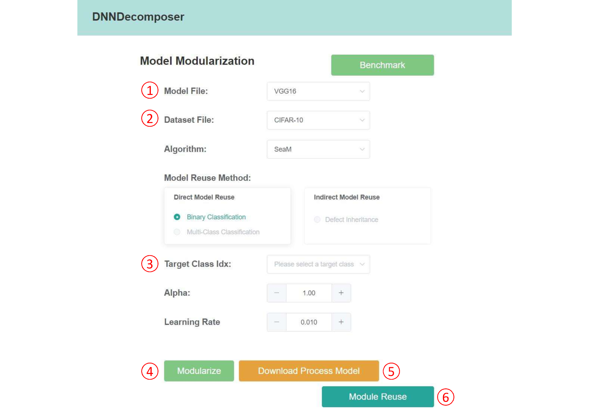

# DNNDecomposer

A Tool for DNN Modularization to Support On-demand Model Reuse

## Abstract

Several DNN modularization methods have been proposed to decompose a DNN model into a set of modules that can be reused independently or by composition. However, existing studies mainly focus on algorithm design and experimental evaluation. There lacks a tool supporting the modularization process. To fill in the gap, we present DNNDecomposer, a tool for providing integrated support for realizing model decomposition and module reuse. DNNDecomposer is implemented based on two DNN modularization approaches proposed by us previously. With DNNDecomposer, one can easily decompose trained model to modules on demand, and reuse modules for inference, building more accurate model or composing modules across models. Evaluations on widely-adopted models demonstrate that DNNDecomposer significantly curtails the overhead associated with model reuse. Impressively, it achieves model decomposition while improving classification accuracy in the target task through out-of-the-box operation. 

## Requirements

- Python v3.8.10
- Pytorch v1.8.1
- Argparse v1.4.0
- GPU with CUDA support

## Structure of the directories

```
[todo]
```

## Architecture



## UI design

Users first specify the model that needs to be decomposed, and then select the corresponding dataset. DNNDecomposer will provide the model trained on the corresponding dataset. Next, select the target task and click the “Modularize” button to send the task configurations to the server to execute the corresponding pipeline. The results will be sent back to the log box of the web interface, showing the evaluation of the decomposition. The decomposed modules can be downloaded by clicking “download”, or by clicking “reuse” to perform the reuse function we offer.

